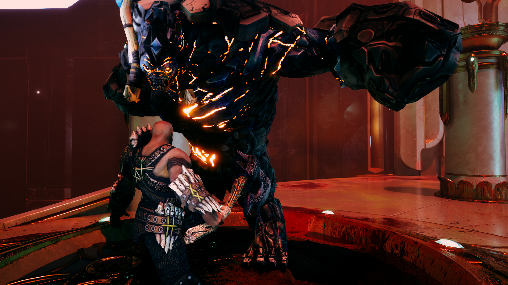

# WarriorGame

## Gameplay Preview

Unreal Engine 5 C++ third-person action project.

## Systems Implemented

- Modular Combat Component System
- AI Behavior Tree Integration
- Gameplay Tags Architecture
- SaveGame Framework
- GameInstance Manager
- Custom Debug Helper
- Modular Item / Weapon System

## Architecture

The project follows a modular design pattern:
- Combat logic isolated into components
- Weapon hierarchy abstracted via base classes
- Gameplay tags used for extensible logic
- Interfaces for decoupling systems

## Tech Stack

- Unreal Engine 5
- C++
- Gameplay Tags
- Behavior Trees
- Modular component architecture